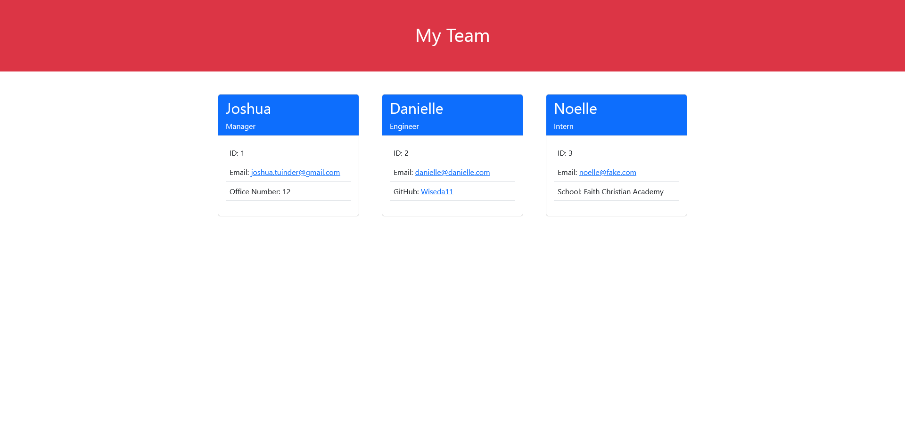

# Profile Generator

## Description

This CLI application can make a simple webpage that displays some information and links about your employees.

- My motivation for making this application was to learn more about creating dynamic webpages based on user provided information.
- Why did you build this project?
- This solves the problem of time wasted manually creating an information page for employees.
- I learned more about the use of expressions inside of template literals.

## Table of Contents

- [Installation](#installation)
- [Usage](#usage)
- [Credits](#credits)
- [License](#license)
- [Questions](#questions)

## Installation

Clone or fork this repository and run 'npm i'. After that, run the command npm start and the application will run.

## Usage

Navigate to the folder this app was cloned to and run the command 'npm start'. Answer the questions that come up. After answering the questions, an index.html file will be created in the dist folder inside of the folder that the app is located.

[Video Walkthrough](./assets/videos/walkthrough.mp4)

## Credits

N/A

## License

N/A

## Tests

Run the command 'npm test'.

## Questions

If you have any questions about this project, [visit my GitHub Profile](https://github.com/TuinderJ/) or [Email Me](mailto:joshua.tuinder@gmail.com)
